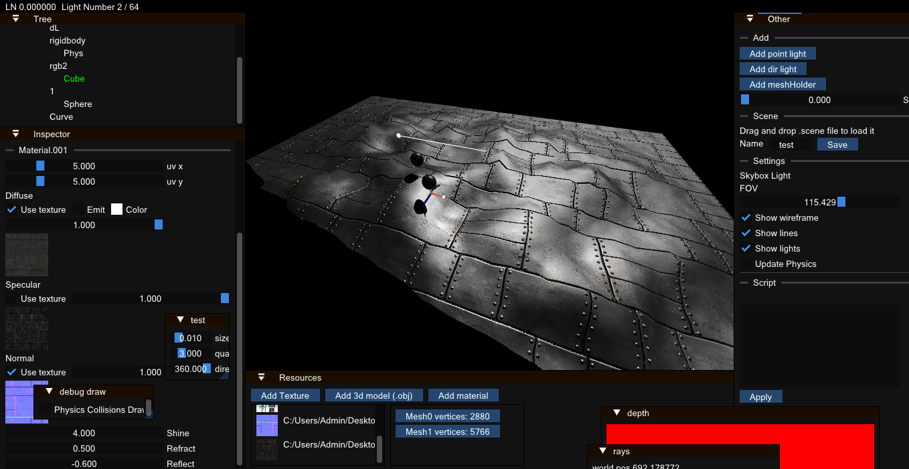
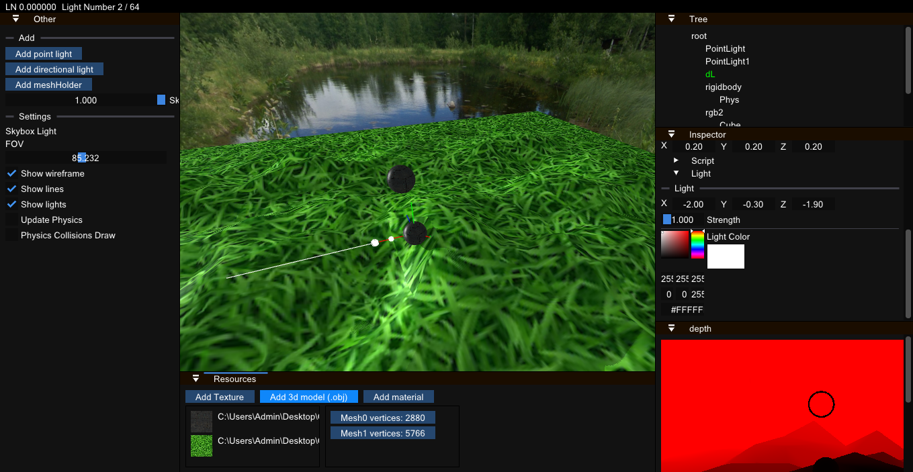

# DrishEngine

>Drish is life, life is drish

  

Drish Engine is 3d game engine created for fun

## Screenshots
<table>
  <tr><td></td></tr>
  <tr><td></td></tr>
</table>

## Resources used
- [ImGui](https://github.com/ocornut/imgui)
- [stb](https://github.com/nothings/)
- [Native File Dialog Extended](https://github.com/btzy/nativefiledialog-extended)
- [Bullet Physics](https://github.com/bulletphysics/bullet3)
- [sol2](https://github.com/ThePhD/sol2)
- [glm](https://github.com/g-truc/glm)
- [glfw](https://github.com/glfw/glfw)
- [glew](https://github.com/nigels-com/glew)

